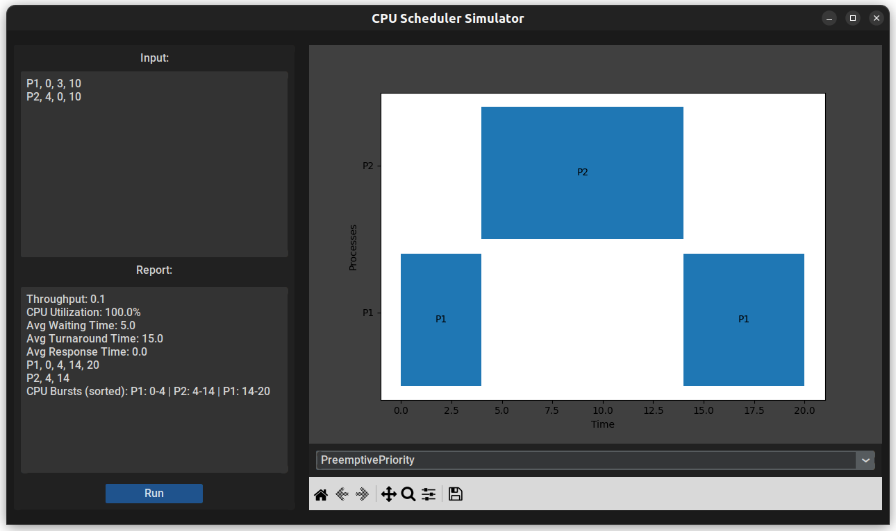

# Operating System CPU Scheduler Algorithms Simulator
This is a CPU Scheduler Simulator application that is able to
simulate 6 algorithms (FCFS, Non-preemptive Priority, Preemptive Priority, Non-preepmtive SJF, Preemptive SJF & Round Robin) and calculate statistics
like Throughput, Average Waiting Time and etc for each algorithm. Also the GUI Can draw Gantt chart for each algorithm using Tkinter and Matplotlib.

### Usage:
The application can be used either in GUI mode or Script mode.

#### Script Mode:
1) Rename list.txt.sample to list.txt

    You can write your processes data in this template in each line: Process Name, Arrival Time, Priority, Burst Time. Smaller priority number means higher priority level.

2) Use `python3 app.py execute` to run script mode.

    This will read processes data from the list.txt file and execute all the algorithms for that data, then saves a full report for each algorithm in the reports/ directory.

#### GUI Mode:
1) Install dependencies using command: `python3 -m pip install -r requirements.txt`
2) Use `python3 app.py gui` to run GUI mode.

    This will open the GUI application. Write your data in the input text box and choose the algorithm from the algorithms combo box, then click on Run button. The report will be shown in report text box and the Gantt chart will be drawn. You can use the toolbar to work with the chart.

